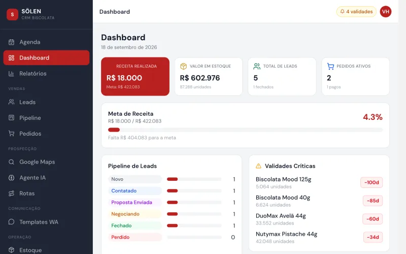
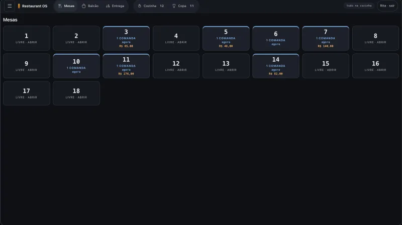
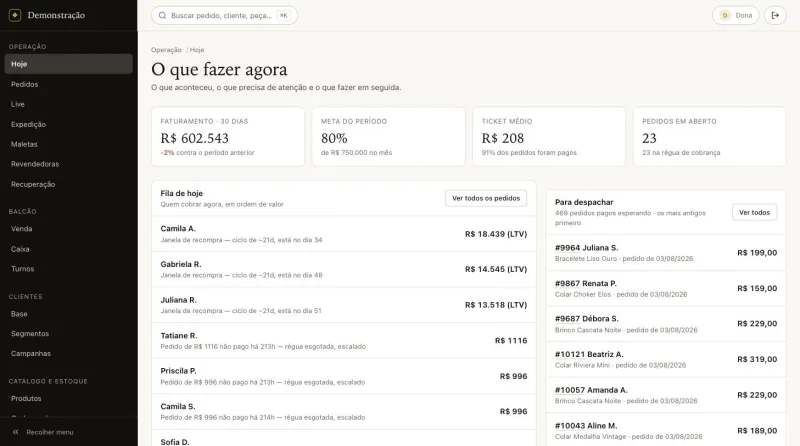
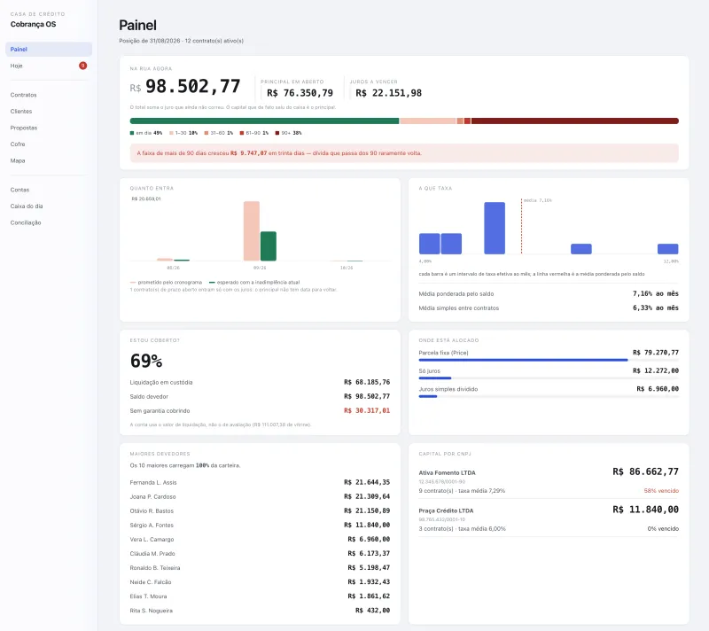
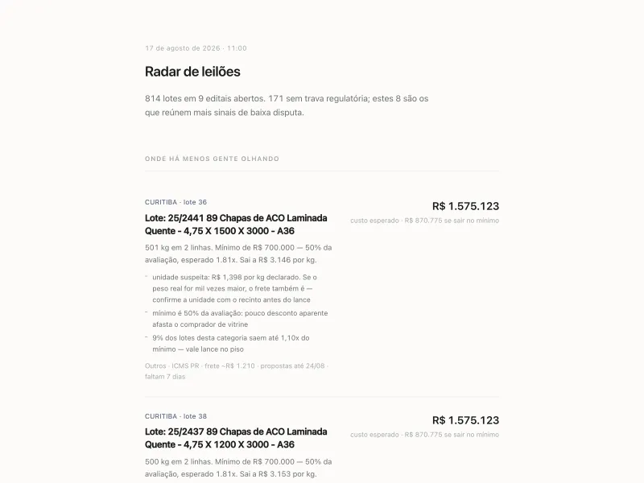
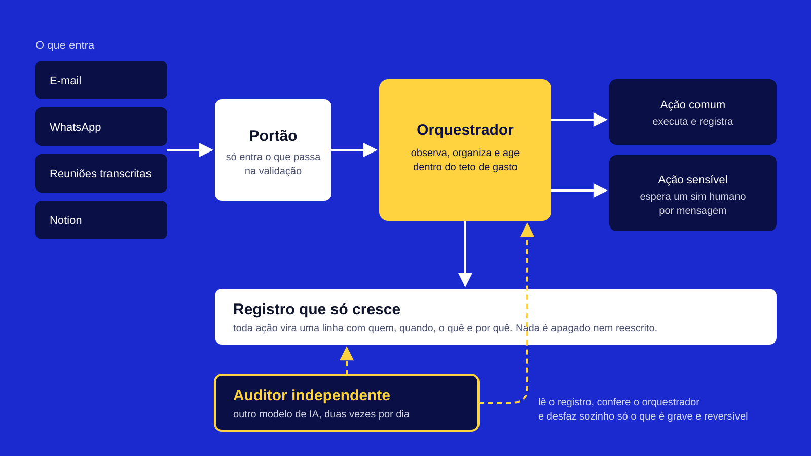

<!-- Gerado por build.py a partir de conteudo/. Não edite à mão. -->

# VH BRANDS — Sistemas sob medida

De uma empresa suíça de certificação de joias a uma rede de clínicas: sistemas completos, do banco de dados ao aplicativo no celular, construídos para a regra de cada negócio e testados antes de chegar na mão de quem usa.

**[Abrir o portfólio completo →](https://vhboscolo.github.io/portfolio/)**

---

## 01 · GMA

**Uma empresa suíça me contratou para construir o sistema inteiro de certificação e garantia de joias**

Software de gestão de garantias para joias. Do zero ao ar: servidor, banco, painel de gestão, validação pública dos certificados, aplicativo que grava os cartões NFC e tudo o que envolve o certificado, do laudo ao cartão físico.

`Certificação e garantia de joias` · `No ar, em produção` — [ver telas e engenharia →](https://vhboscolo.github.io/portfolio/gma/)

---

## 02 · Plataforma de saúde da Serfaty Clínicas

**Do agendamento pelo celular ao prontuário assinado, a clínica inteira numa plataforma**

Três pontas na mesma plataforma: a paciente, que agenda, preenche a ficha e manda exames pelo celular; a equipe, que recebe, atende, prescreve e assina; e a direção, que controla quem acessa cada prontuário. Mais o site da clínica, com atlas do corpo em 3D e calculadora de risco.

`Saúde` · `Plataforma completa, site no ar` — [ver telas e engenharia →](https://vhboscolo.github.io/portfolio/clinicas/)

---

## 03 · CRM de vendas com prospecção por IA

**A distribuidora acha o cliente no Google Maps, a IA qualifica e o vendedor fecha pelo WhatsApp**

Sistema comercial de uma distribuidora de chocolates importados. Prospecta supermercados e empórios no Google Maps, qualifica os leads com inteligência artificial, dispara sequências de follow-up no WhatsApp, monta a proposta, controla o estoque pela validade e mostra ao dono o que fazer hoje.

`Distribuição e vendas B2B` · `No ar, em uso` — [ver telas e engenharia →](https://vhboscolo.github.io/portfolio/crm-solen/)

---

## 04 · RESTAURANT OS

**O bar continua vendendo com a internet caída**

Salão, balcão, cozinha, delivery, estoque, ficha técnica e financeiro num sistema só, rodando na máquina do próprio salão. Se o Wi-Fi cair numa sexta à noite, a casa segue lançando pedido.

`Bar e restaurante` · `Pronto para implantar` — [ver telas e engenharia →](https://vhboscolo.github.io/portfolio/restaurant-os/)

---

## 05 · Jewelry OS

**A live termina com pedido, estoque, cobrança e etiqueta prontos**

Live, balcão, loja online, atacado e consignação sobre o mesmo estoque, o mesmo cliente e o mesmo resultado. A tela inicial não mostra o que aconteceu: mostra o que fazer agora.

`Joias e semijoias` · `Pronto para implantar` — [ver telas e engenharia →](https://vhboscolo.github.io/portfolio/jewelry-os/)

---

## 06 · COBRANÇA OS

**Quanto está na rua, quanto apodreceu e se a garantia cobre**

Sistema para casa de crédito que empresta com bem em custódia. Reparte cada pagamento em multa, mora, juros e principal, e calcula a cobertura pelo valor de liquidação do bem, não pelo de vitrine.

`Crédito com garantia` · `Pronto para implantar` — [ver telas e engenharia →](https://vhboscolo.github.io/portfolio/cobranca-os/)

---

## 07 · Catálogos de importação para lojistas

**A lojista escolhe a peça de fábrica e vê quanto paga e quando**

Dois sistemas para vender peça importada no atacado. Um transforma a planilha da fábrica em catálogo técnico com foto tratada. O outro deixa a lojista montar o pedido vendo o preço de fábrica, a taxa de intermediação em linha separada e o sinal que vai pagar.

`Importação e atacado de joias` · `Dois catálogos no ar` — [ver telas e engenharia →](https://vhboscolo.github.io/portfolio/catalogos-importacao/)

---

## 08 · Radar de leilões

**Onde olhar primeiro nos leilões da Receita Federal**

Varre os leilões abertos, estima o custo real de cada lote com imposto e frete, lê o edital atrás de travas escondidas e destaca onde há menos gente disputando. Conferido contra 12.813 arremates que o modelo nunca tinha visto.

`Leilões de mercadoria apreendida` · `Em uso próprio` — [ver telas e engenharia →](https://vhboscolo.github.io/portfolio/radar-leiloes/)

---

## 09 · Agente autônomo auditável

**Uma IA que trabalha sozinha e deixa rastro de tudo que faz**

Um agente que observa e-mail, WhatsApp, reuniões e Notion, organiza o que importa e age. Cada ação vira uma linha num registro que ninguém reescreve, e um segundo agente, em outro modelo de IA, audita o primeiro duas vezes por dia.

`Automação com inteligência artificial` · `Protótipo funcional` — [ver telas e engenharia →](https://vhboscolo.github.io/portfolio/agente-auditavel/)

---

## Contato

- [WhatsApp (19) 98959-0630](https://wa.me/5519989590630?text=Oi%2C%20Victor.%20Vi%20o%20portf%C3%B3lio%20de%20sistemas%20e%20quero%20conversar.)
- [vhboscolo@gmail.com](mailto:vhboscolo@gmail.com)
- [Instagram @vhboscolo](https://www.instagram.com/vhboscolo/)
- [LinkedIn /in/vhboscolo](https://www.linkedin.com/in/vhboscolo/)

VH BRANDS · Victor Boscolo. As telas usam dados de demonstração. O código dos sistemas não está neste repositório.
