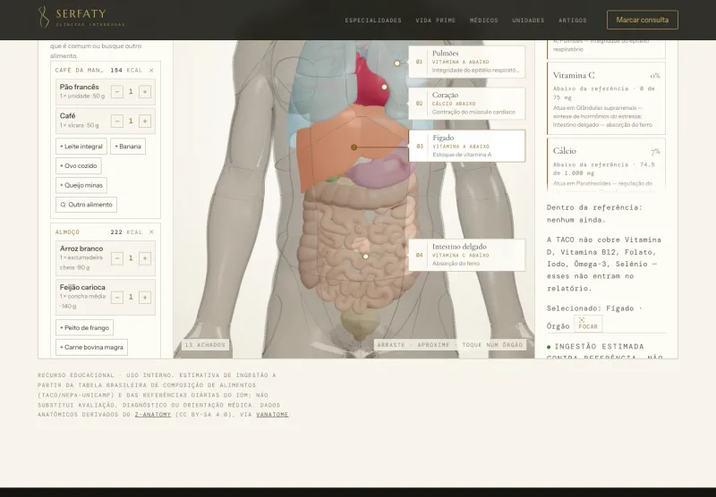

<!-- Gerado por build.py a partir de conteudo/. Não edite à mão. -->

# VH BRANDS — Sistemas sob medida

Bar, joalheria, clínica, casa de crédito, importadora. Cada sistema desta página nasceu de uma operação de verdade, com as regras dela, e foi testado antes de chegar na mão de quem usa.

**[Abrir o portfólio completo →](https://vhboscolo.github.io/portfolio/)**

---

## 01 · RESTAURANT OS

**O bar continua vendendo com a internet caída**

Salão, balcão, cozinha, delivery, estoque, ficha técnica e financeiro num sistema só, rodando na máquina do próprio salão. Sexta à noite, com o Wi-Fi do shopping fora, a casa segue lançando pedido.

`Bar e restaurante` · `Em uso num bar de shopping` — [ver telas e engenharia →](https://vhboscolo.github.io/portfolio/restaurant-os/)

---

## 02 · Jewelry OS

**A live termina com pedido, estoque, cobrança e etiqueta prontos**

Live, balcão, loja online, atacado e consignação sobre o mesmo estoque, o mesmo cliente e o mesmo resultado. A tela inicial não mostra o que aconteceu: mostra o que fazer agora.

`Joias e semijoias` · `Em teste com loja-modelo` — [ver telas e engenharia →](https://vhboscolo.github.io/portfolio/jewelry-os/)

---

## 03 · GMA

**O laudo é do laboratório, e o cliente confere pelo QR**

Plataforma de certificação: o laboratório emite o laudo, a peça sai com um cartão numerado e qualquer pessoa confere a autenticidade apontando o celular para o código. Funciona como aplicativo instalável, em três idiomas.

`Certificação de joias e gemas` · `No ar` — [ver telas e engenharia →](https://vhboscolo.github.io/portfolio/gma/)

---

## 04 · Operação digital de uma rede de clínicas

**Site, atlas do corpo em 3D, calculadora clínica e prontuário sob LGPD**

Um caso só, quatro entregas: o site institucional da Serfaty Clínicas, um atlas anatômico navegável, uma calculadora de risco cardiovascular conferida contra 160 casos de referência e um prontuário eletrônico desenhado sob a LGPD desde a primeira linha.

`Saúde` · `Site no ar, prontuário em construção` — [ver telas e engenharia →](https://vhboscolo.github.io/portfolio/clinicas/)

---

## 05 · COBRANÇA OS

**Quanto está na rua, quanto apodreceu e se a garantia cobre**

Sistema para casa de crédito que empresta com bem em custódia. Reparte cada pagamento em multa, mora, juros e principal, e calcula a cobertura pelo valor de liquidação do bem, não pelo de vitrine.

`Crédito com garantia` · `Pronto para demonstração` — [ver telas e engenharia →](https://vhboscolo.github.io/portfolio/cobranca-os/)

---

## 06 · Catálogos de importação para lojistas

**A lojista escolhe a peça de fábrica e vê quanto paga e quando**

Dois sistemas para vender peça importada no atacado. Um transforma a planilha da fábrica em catálogo técnico com foto tratada. O outro deixa a lojista montar o pedido vendo o preço de fábrica, a taxa de intermediação em linha separada e o sinal que vai pagar.

`Importação e atacado de joias` · `Dois catálogos no ar` — [ver telas e engenharia →](https://vhboscolo.github.io/portfolio/catalogos-importacao/)

---

## 07 · Radar de leilões

**Onde olhar primeiro nos leilões da Receita Federal**

Varre os leilões abertos, estima o custo real de cada lote com imposto e frete, lê o edital atrás de travas escondidas e destaca onde há menos gente disputando. Conferido contra 12.813 arremates que o modelo nunca tinha visto.

`Leilões de mercadoria apreendida` · `Em uso próprio` — [ver telas e engenharia →](https://vhboscolo.github.io/portfolio/radar-leiloes/)

---

## 08 · Agente autônomo auditável

**Uma IA que trabalha sozinha e deixa rastro de tudo que faz**

Um agente que observa e-mail, WhatsApp, reuniões e Notion, organiza o que importa e age. Cada ação vira uma linha num registro que ninguém reescreve, e um segundo agente, em outro modelo de IA, audita o primeiro duas vezes por dia.

`Automação com inteligência artificial` · `Protótipo funcional, pausado` — [ver telas e engenharia →](https://vhboscolo.github.io/portfolio/agente-auditavel/)

---

## Contato

- [WhatsApp (19) 98959-0630](https://wa.me/5519989590630?text=Oi%2C%20Victor.%20Vi%20o%20portf%C3%B3lio%20de%20sistemas%20e%20quero%20conversar.)
- [vhboscolo@gmail.com](mailto:vhboscolo@gmail.com)
- [Instagram @vhboscolo](https://www.instagram.com/vhboscolo/)
- [LinkedIn /in/vhboscolo](https://www.linkedin.com/in/vhboscolo/)

VH BRANDS · Victor Boscolo. As telas usam dados de demonstração. O código dos sistemas não está neste repositório.
